# registroprestamos
guia-para-la-implementacion-de-sistema-de-prestamos-bibliotecarios
==================================================================

Web2py es un framework gratuito de c&oacute;digo abierto y de pila completa para el desarrollo r&aacute;pido de aplicaciones basadas en web r&aacute;pidas, escalables, seguras y port&aacute;tiles basadas en bases de datos. Escrito y programable en Python (versi&ooacute;n 3 y 2.7).

Hemos usado este framework para programar e implementar un sistema de pr&eacute;stamos y devoluciones que les ayude a las bibliotecarias(os) del sistema a llevar un control sobre esta actividad esencial en su trabajo.

## Primer Paso: Tener web2py funcionando en el servidor o en la PC

### En Windows

En caso de tener windows instalado y se quiera tener el sistema de pr&eacute;stamos local se debe descargar la versi&oacute;n de web2py para windows desde :

https://mdipierro.pythonanywhere.com/examples/static/web2py_win.zip

Este archivo compactado se descompacta por ejemplo en el Escritorio de la pc y con el explorador se va dentro de la carpeta  creada y se accede a la carpeta web2py para ejecutar web2py.exe.

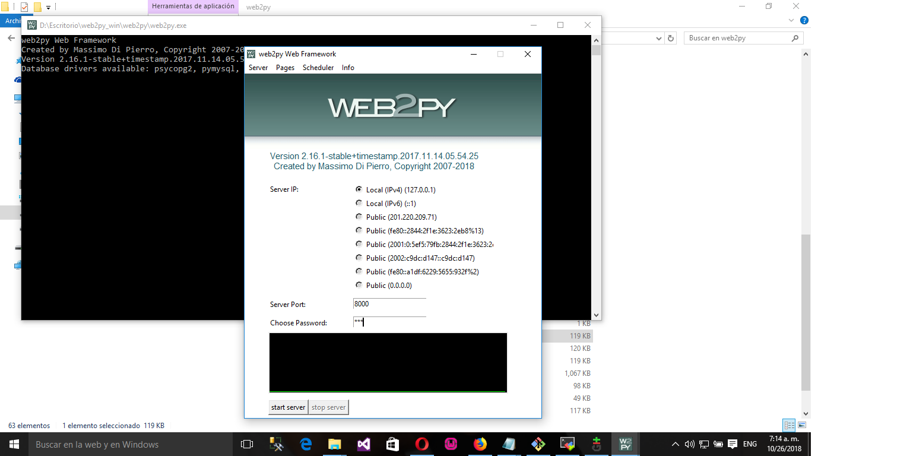

### Servidor web sobre Apache

En caso de querer implementar el servicio como una web disponible para la intranet de salud se debe descargar el c&oacute;digo fuente desde :

https://mdipierro.pythonanywhere.com/examples/static/web2py_src.zip

El archivo descargado con el c&oacute;digo fuente de web2py se descompacta en carpeta /srv.

En Servidor Apache se puede crear un virtualhost para redireccionar las peticiones web al server virtual o f&iacute;sico donde tengamos funcionando web2py.

Ejemplo:

<VirtualHost *:80>
    ServerName web2py.xxx.sld.cu
    ProxyRequests Off
    ProxyPreserveHost On
    ProxyPass / http://X.Y.Z.V:8000/ retry=0
    ProxyPassReverse / http://X.Y.Z.V:8000/ retry=0
    LogLevel warn
    CustomLog ${APACHE_LOG_DIR}/access.log combined
</VirtualHost>

Luego en el servidor virtual o f&iacute;sico se debe tener instalado python y el archivo /etc/rc.local se escribe esta l&iacute;nea:

<pre>/usr/bin/python /srv/web2py/web2py.py -i 0.0.0.0 -a <se escribe la password de inicio> -p 8000</pre>

Esta sentencia har&aacute; que al reiniciar el servidor se inicie el servicio de web2py con su server propio escuchando por el puerto 8000, dicho puerto puede ser cambiado en la misma l&iacute;nea escrita en /etc/rc.local. 
 

## Implementar sistema de pr&eacute;stamos dentro de web2py

El sistema de pr&eacute;stamos que pueden descargar desde el github  http://github.red.sld.cu/eafcub/regprestamosbibliotecarios/archive/master.zip

Se crea dentro de la carpeta applications que est&aacute; dentro de la carpeta web2py de /srv o de la que tenemos en el escritorio una nueva subcarpeta llamada  sistemadeprestamos y dentro de ella se pone lo que se descarg&oacute; en el paso anterior del github.

Es posible personalizar las &aacute;reas de salud en las cuales existen bibliotecas que usar&aacute;n el sistema, para eso dentro de la carpeta de la aplicaci&oacute;n hay una subcarpeta views en la cual est&acute; el fichero layout.html.

Al inicio de ese fichero se actualiza el arreglo areas de la sgte forma. Los nombres de las areas deben estar entre corchetes separados por comas.

<pre>{{areas=['Area1','Area2','Area3','Area4','Area5','Area 6','Area7','Area7','Area8','UCM','GAL','Hosped','Hosp Psiquiatrico','CPHE','UMHE','DMS CFG','B.Sangre','Pol Aguada','Pol Palmira','Pol Camarones','Pol Cruces','Hosp. Aguada','Pol Rodas','Pol Lajas','Pol Cumanayagua','Pol Abreus','Pol Yaguaramas','Pol Cartagena','DMS Aguada','DMS Palmira','DMS Rodas','DMS Cruces','DMS Lajas','DMS Cumanayagua']}}
</pre>

Es posible adem&aacute;s personalizar el logo cambiando la imagen del header de la p&aacute;gina. Esto se hace buscando la carpeta de la aplicaci&oacute;n, en la cual hay una subcarpeta static y dentro de ella otra con nombre images  en la que hay un fichero registroprestamos.jpg, que se puede sustituir por el propio de la instituti&oacute;n(se sugiere 1538 por 500 px).

## Acceso a sistema de pr&eacute;stamos

Si lo accedemos desde windows entonces debemos colocar en el navegador la url http://127.0.0.1:8000/sistemadeprestamos/. 

En windows además podemos colocar un fichero app.bat en la carpeta externa a la instalaci&oacute;n del web2py con el siguiente contenido. Donde dice contrase&ntilde;a debe escribirse la contrase&ntilde;a de arranque de web2py en texto plano.

<pre>@echo off
start /min ./web2py/web2py.exe -a <contrase&ntilde;a>&
start http://127.0.0.1:8000/sistemadeprestamos/default/index</pre>

Al ejecutar el app.bat se abre el navegador con la aplicaci&oacute;n de pr&eacute;stamos.

En el caso de que se acceda a la instaci&oacute;n en el servidor virtual o f&iacute;sico ser&iacute; desde la url http://X.Y.Z.V:8000/sistemadeprestamos

X.Y.Z.V es el IP del servidor donde est&aacute; alojada la aplicaci&oacute;n.

## Uso de sistema de pr&eacute;stamos

B&aacute;sicamente las funciones que podemos hacer son registrar los pr&eacute;stamos de los usuarios de las bibliotecas, notificar al sistema que esos pr&eacute;stamos fueron devueltos y generar una estad&iacute;stica.

El primer paso ser&aacute; crear un usuario que pueda registrar pr&eacute;stamos.

Se accede a el apartado administrar de la barra de herramientas de la Aplicaci&oacute;n con el nombre de usuario admin y la contrase&ntilde;a admin.

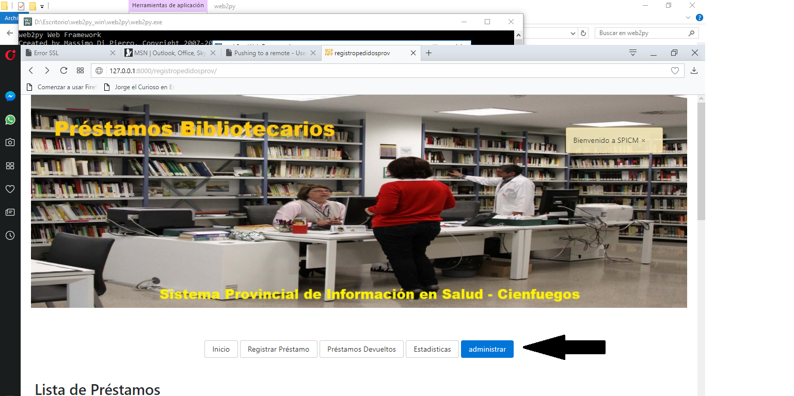

Luego se oprime el bot&oacute;n Add Record como se muestra en la imagen que sigue:

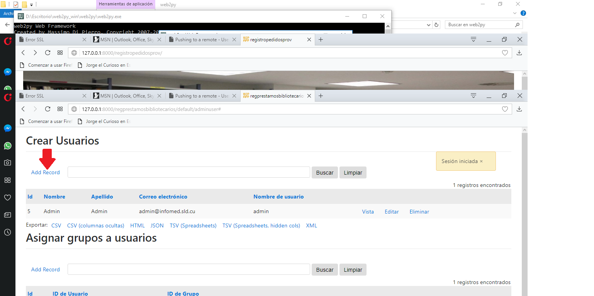

Y se introducen los campos que se muestran en el formulario

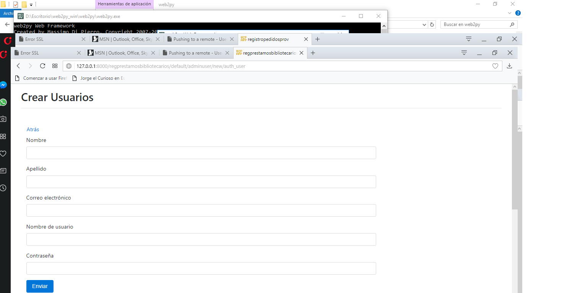

Dicho usuario debe ser agregado al grupo que puede registrar pr&eacute;stamos como se muestra 

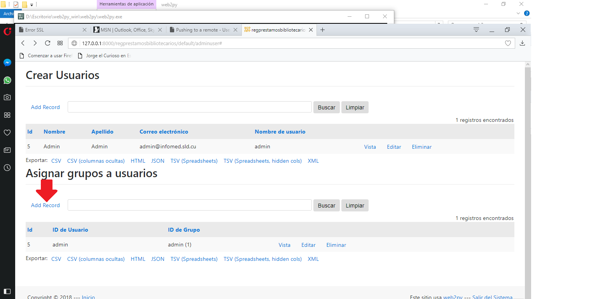

En el formulario se debe escoger en la lista de usuarios el que corresponde y el grupo al cual hay que agregarlo es administrar 

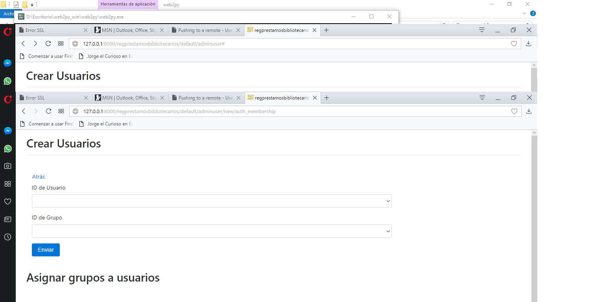

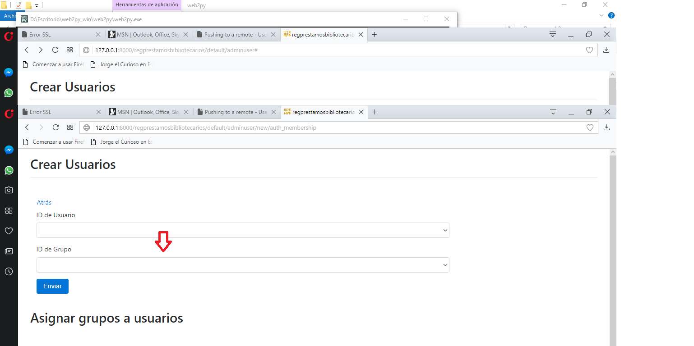

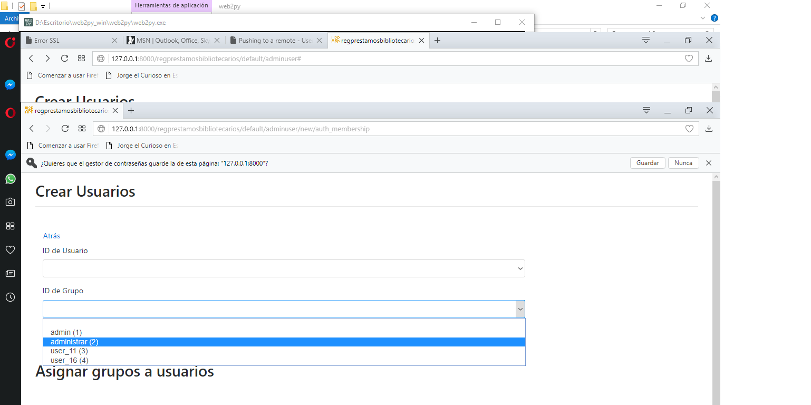

Al terminar estas operaciones se mueve al pie de la web para hacer logout

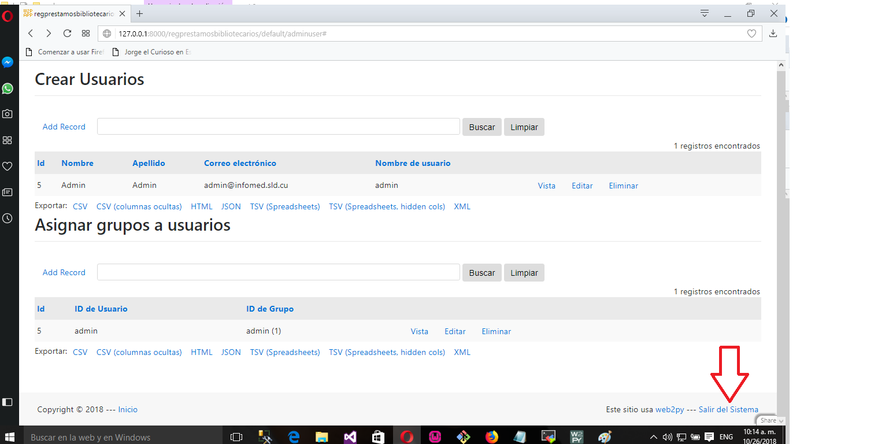

Luego en la pantalla principal al seleccionar la opci&oacute;n Registrar Pr&eacute;stamo nos aparece una pantalla de login para acceder con el usuario reci&eacute;n creado.

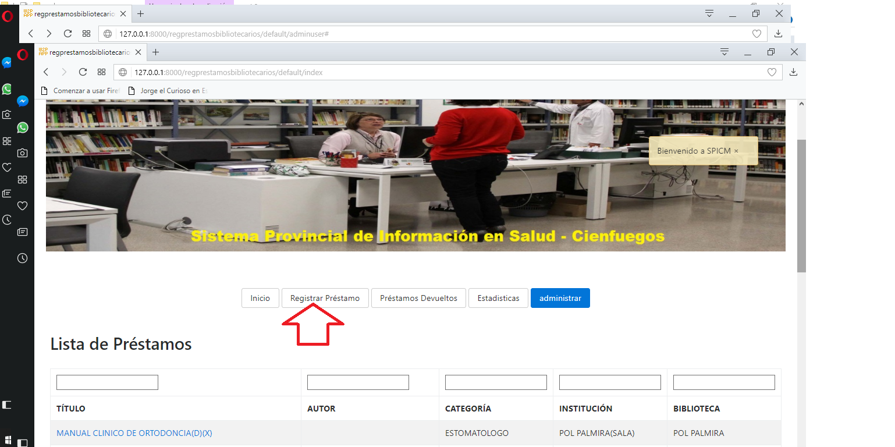

Habiendo accedido al sistema ya podemos tomar los datos del pr&eacute;stamo. En ese formulario a un usuario se le pueden prestar varios libros por eso aparece el bot&oacute;n m&aacute;s de modo que se puedan agregar todos los pr&eacute;stamos del usuario.

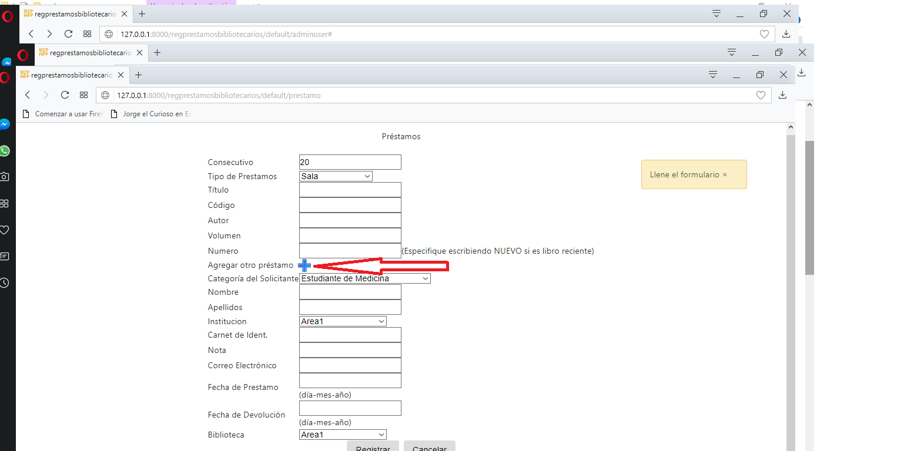

La fecha de devoluci&oacute;n no es necesario que se coloque en este  momento.

Al registrar el pr&eacute;stamos el sistema nos redirige a la portada en la cu&aacute;l podemos editar el pr&eacute;stamo, borrarlo(Clic sobre la X que est&aacute; junto al t&iacute;tulo del material) y notificarlo como devuelto(Haciendo clic sobre la D junto al t&iacute;tulo).

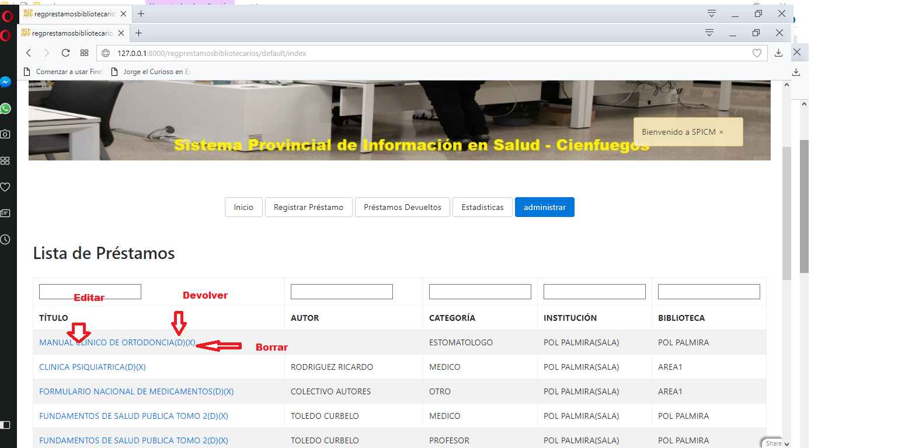

Luego que el pr&eacute;stamo fue devuelto se puede acceder se puede acceder al apartado Pr&eacute;stamos Devueltos donde se pueden hacer b&uacute;squedas para localizar y actualizar registros.

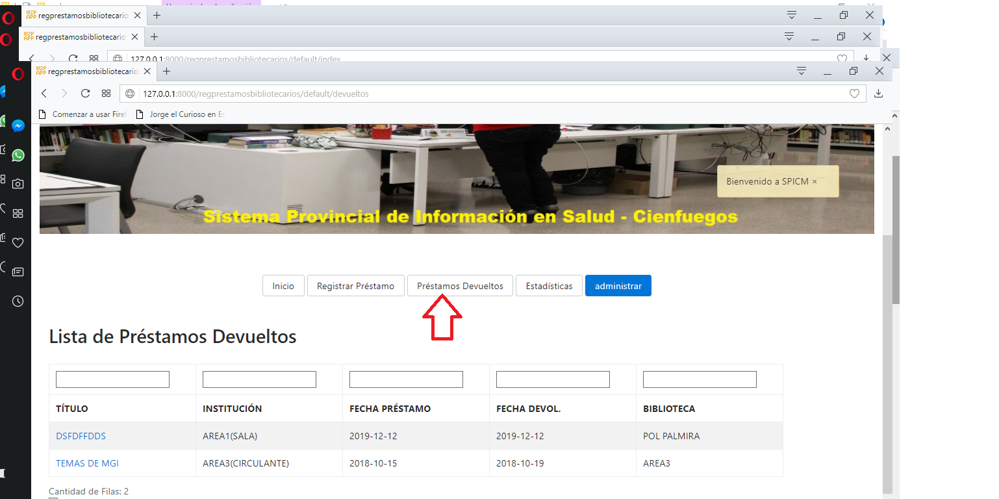

Las estad&iacute;sticas se extraen el apartado estad&iacute;sticas en el cual colocando la fecha y la instituci&oacute;n se saben datos globales de los pr&eacute;stamos realizados.

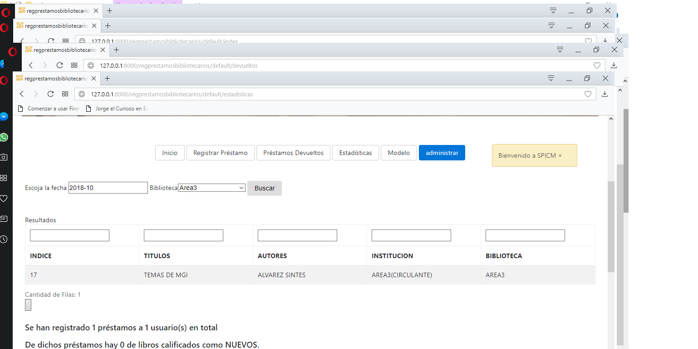

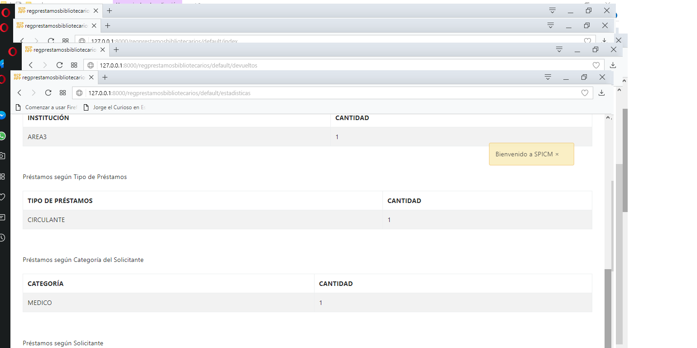

